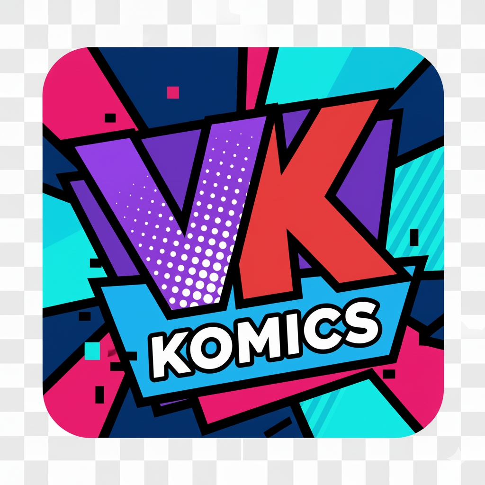

# 

# Vkomic

Une application qui se branche sur https://vk.com/board203785966 et permet de telecharger les BD, mangas et comics disponibles.

## Telechargements

- Windows installeur : `.exe`
- Windows portable : archive `.zip`
- macOS : `.dmg` (installation) ou `.zip` (auto-update)
- Linux : binaire `.AppImage` (ou archive `.tar.gz` selon la release)
- Android : `.apk` (installation manuelle)

Rendez-vous sur la derniere release : https://github.com/G-kylexy/vkomic/releases/latest

### Lancer

- Windows : telechargez l'`.exe` ou decompressez le `.zip` et lancez Vkomic.
- macOS : ouvrez le `.dmg` puis glissez `Vkomic.app` dans `Applications` (ou utilisez le `.zip`).
- Linux (AppImage) : `chmod +x Vkomic-*.AppImage && ./Vkomic-*.AppImage`.
- Linux (archive) : decompressez puis lancez le binaire fourni.
- Android : telechargez le `.apk`, ouvrez-le et autorisez l'installation depuis les sources inconnues.

## Mises a jour automatiques (macOS)

L'auto-update macOS (electron-updater) utilise les assets de la release GitHub, notamment `latest-mac.yml` + le `.zip` (et eventuellement les fichiers `.blockmap`).
Le fichier `latest-mac.yml` n'est pas "dans" le `.dmg` : il apparait comme un asset sur la page de release quand la publication est faite par `electron-builder`.

Pour un auto-update "100%" sur macOS, l'app doit etre signee (et idealement notarized) et installee dans `Applications`.

## Construire depuis les sources (optionnel)

Prerequis : Node.js, npm

1. Installer les dependances : `npm install`
2. Lancer en dev : `npm run dev`
3. Build (vite) : `npm run build`
4. Build desktop (electron-builder) : `npm run dist`

